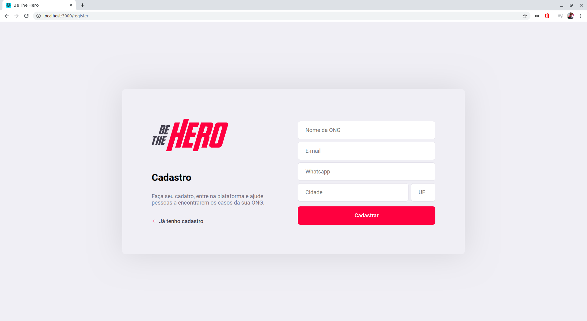
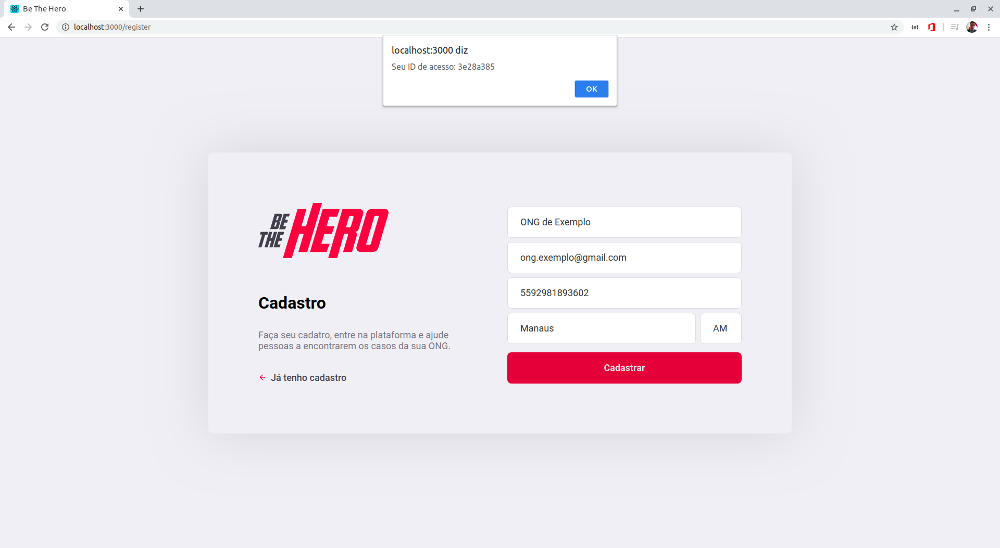
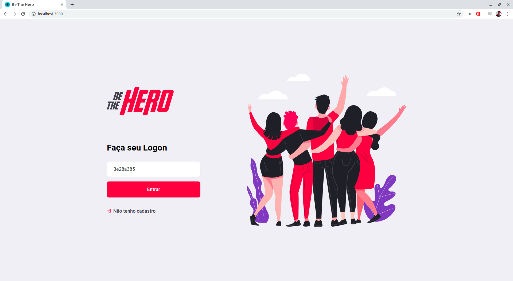
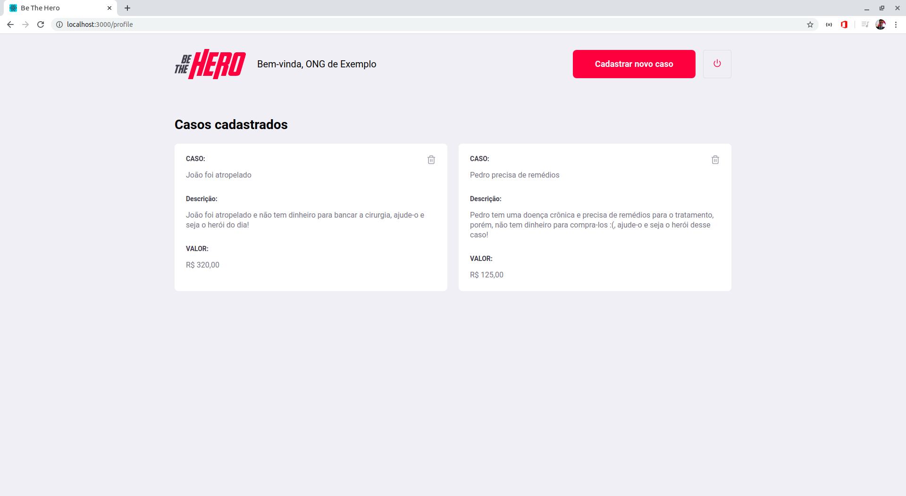

<h1 align="center">
            
            
    
<strong>BE THE HERO</strong>

    
Frontend com ReactJS

</h1>

## Conteúdo
* [Sobre o Projeto](#sobre-o-projeto)
* [Capturas de Tela](#capturas-de-tela)
* [Feito Com](#sobre-o-projeto)
* [Dependências Necessárias](#dependências-necessárias)
* [Como executar](#como-executar)
* [Bibliotecas Utilizadas](#bibliotecas-utilizadas)

## Sobre o projeto
Trata-se de uma aplicação frontend desenvolvida em ReactJS que consome informações de sua [api própria](https://github.com/RCout1nho/Be-The-Hero/tree/master/backend). Nela é possível às ONGs realizarem Login, Cadastro,Logout, Criar um novo caso, Deletar um caso existente.

## Capturas de Tela

<h1 align="space-between">
    
    
    
    
    
    
</h1>

## Feito com
* [ReactJS](https://pt-br.reactjs.org/)

## Dependências Necessárias
Para rodar o projeto você precisa ter instalado na sua máquina o [node](https://nodejs.org/en/download/) e o [yarn](https://yarnpkg.com/) .

## Como executar
Após o clone desse repositório e o download das [dependências necessárias](#dependências-Necessárias), dentro no diretório /frontend execute: `yarn install`  para instalação das dependêcias, e em seguida `yarn start` para rodar a aplicação.

**Atenção:** Por padrão, a aplicação é executada em http://localhost:3000 .

**Atenção:** Caso tenha problemas para rodar `yarn start` em um SO Linux, tente `sudo yarn start` . 

**Atenção:** Lembre-se de executar o [backend](https://github.com/RCout1nho/Be-The-Hero/blob/master/backend/README.md#como-executar) para que o frontend possa fazer interações com  api.

**Atenção:** Caso seu backend esteja rodando em um endereço diferente de http://localhost:3333 é possível alterar o endereço de acesso à api em ./frontend/src/services/api.js , apenas alterando a `baseURL`
.

## Bibliotecas Utilizadas

* [react](https://pt-br.reactjs.org/)
* [axios](https://github.com/axios/axios)
* [react-dom](https://pt-br.reactjs.org/docs/react-dom.html)
* [react-icons](https://react-icons.netlify.com/#/)
* [react-router-dom](https://www.npmjs.com/package/react-router-dom)
* [react-scripts](https://www.npmjs.com/package/react-scripts)
