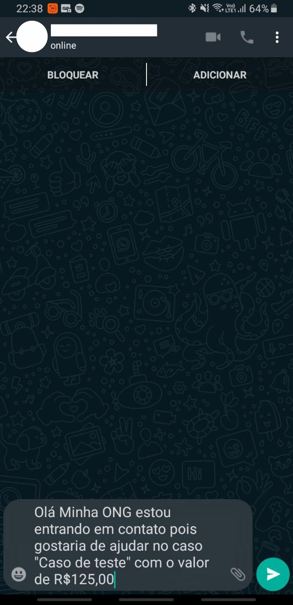

<h1 align="center">
            
            
            
    
<strong>BE THE HERO</strong>

    
Mobile com React Native e Expo

</h1>

## Conteúdo
* [Sobre o Projeto](#sobre-o-projeto)
* [Capturas de Tela](#capturas-de-tela)
* [Feito Com](#feito-com)
* [Dependências Necessárias](#dependências-necessárias)
* [Como executar](#como-executar)
* [Bibliotecas Utilizadas](#bibliotecas-utilizadas)

## Sobre o projeto
Trata-se de uma aplicação mobile multiplataforma desenvolvida com [React Native](https://reactnative.dev/) e [Expo](https://expo.io/),o que significa que com apenas um código, é possível rodar o aplicativo tanto em **Ios** quanto em **Android**. A aplicação consome uma [api própria](https://github.com/RCout1nho/Be-The-Hero/tree/master/backend) , exibindo em tela os dados recuperados da mesma. Também usa os conceitos de **Deep Linking** para fazer interações com um **cliente de e-mail** e com o **Whatsapp**.

## Capturas de Tela

<h1 align="center">
    
    
    
    
    
</h1>

## Feito com
* [React Native](https://reactnative.dev/)
* [Expo](https://expo.io/)

## Dependências Necessárias
Para rodar o projeto você precisa ter instalado na sua máquina o [node](https://nodejs.org/en/download/), [yarn](https://yarnpkg.com/) e as [dependências específicas de React Native](https://docs.rocketseat.dev/ambiente-react-native/introducao).

## Como executar
Após o clone desse repositório e o download das [dependências necessárias](#dependências-Necessárias), dentro no diretório /mobile execute: `yarn install`  para instalação das dependêcias, e em seguida `yarn start` para rodar a aplicação.

Após executado `yarn start` será aberta uma página do **expo** no seu browser, você terá a opção de executar a aplicação em um emulador local ou no seu dispositivo físico(Baixe o app expo da loja do SO do seu smartphone e escanei o QRCode).

**Atenção:** Por padrão, a aplicação é executada em http://192.168.0.10:3333, altere as constantes `url` e `port` em ./mobile/src/services/api.js de acordo com a utilizada - A `url` deve corresponder à url mostrada no **canto inferior esquerdo do expo**(sem a porta), exemplo: se no expo está "http://192.168.0.10:1900", o valor de `url` deve ser `http://192.168.0.10` ou seja:

 `const url ="http://192.168.0.10"` 

 Já o valor de `port` deve corresponder a porta onde está rodando a **api do backend** que por padrão é 3333, porém pode ser alterada caso haja necessidade diretamente no script de /backend, certifique que portas utilizadas em `./mobile/src/services/api.js` e em `./backend/src/server.js` são iguais, caso contrário, a aplicação mobile não conseguirá acessar a api. 

**Atenção:** Caso tenha problemas para rodar `yarn start` em um SO Linux, tente `sudo yarn start` . 

**Atenção:** Lembre-se de executar o [backend](https://github.com/RCout1nho/Be-The-Hero/blob/master/backend/README.md#como-executar) para que o mobile possa fazer interações com  api.

## Bibliotecas Utilizadas

* [react](https://pt-br.reactjs.org/)
* [react-native](https://reactnative.dev/)
* [expo](https://expo.io/)
* [axios](https://github.com/axios/axios)
* [react-dom](https://pt-br.reactjs.org/docs/react-dom.html)
* [react-navigation](https://reactnavigation.org/) (e todas as suas dependências)
